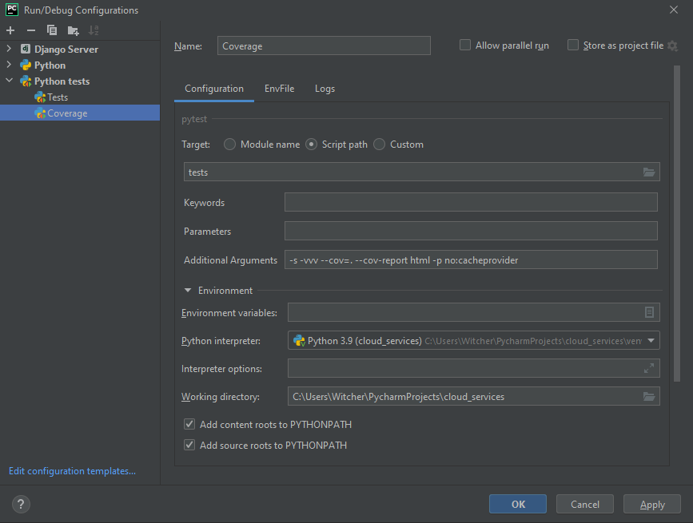
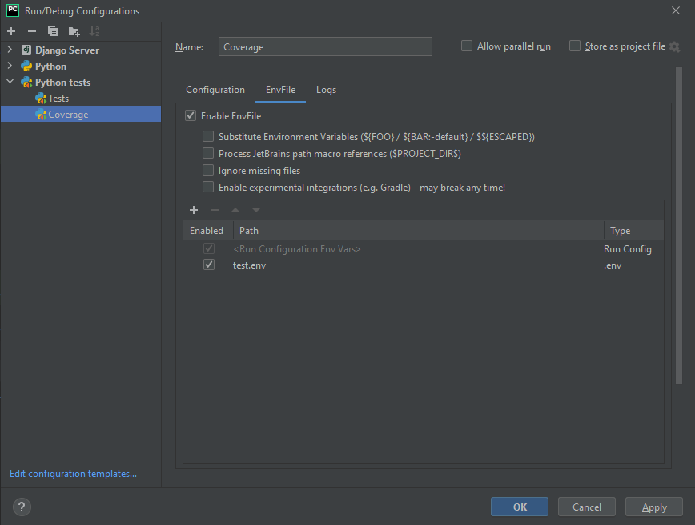

# Cloud Services interview task

## Installation

```bash
python3 -m venv ./venv
source ./venv/bin/activate
pip install poetry
poetry install
```

## Usage

Docs are here:  http://localhost:8000/api/v1/docs

Run server: ```python manage.py runserver 8000```

Build image: ```docker build . --rm -t cloud_services```

Run container: ```docker run -itd -p 8000:8000 cloud_services```

## Initialization

Creating user: http://localhost:8000/api/v1/auth/

## Configuration

Example env vars are available in ```local.env```

## Authorization

#### Creating JWT token

```http://localhost:8000/api/v1/auth/jwt/create``` with body

```json
{
  "username": "admin",
  "password": "adminadmin"
}
```

#### Verifying JWT token

```http://localhost:8000/api/v1/auth/jwt/verify``` with body

```json
{
  "token": "ACCESS_TOKEN"
}
```

#### Using JWT Token

```http://localhost:8000/``` with headers

```json
{
  "Authorization": "JWT ACCESS_TOKEN"
}
```

## Testing

#### Using Docker image

```bash
docker build -f .\dev.Dockerfile . --rm -t cloud_services
docker run --env-file .\test.env cloud_services python -m pytest -s -vvv -p no:cacheprovider
```

#### Local manual

```bash
export $(grep -v '#.*' test.env | xargs)
python -m pytest tests -s -vvv -p no:cacheprovider
```

#### Using PyCharm




EnvFile plugin: https://plugins.jetbrains.com/plugin/7861-envfile

## Author

Oleksandr Kudryavtsev (```14zsoddenu@gmail.com```).